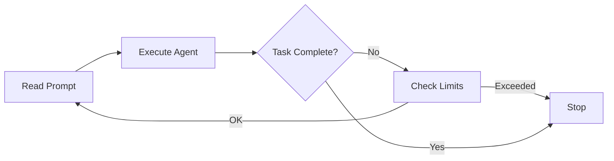

# User Guide Overview

Welcome to the Ralph Orchestrator User Guide! This comprehensive guide will help you master all aspects of Ralph Orchestrator, from basic usage to advanced configurations.

## What You'll Learn

This guide covers:

- **Configuration**: How to customize Ralph's behavior
- **AI Agents**: Working with different AI providers
- **Prompts**: Writing effective prompts for better results
- **Checkpointing**: Using Git integration for state management
- **Cost Management**: Controlling token usage and expenses

## How Ralph Works

### The Orchestration Loop

Ralph Orchestrator implements a simple but powerful pattern:



### Core Components

1. **Prompt File**: Your task description that evolves during execution
2. **AI Agent**: The AI model that processes the prompt
3. **Orchestrator**: The control loop that manages iterations
4. **Checkpoints**: Git commits that save progress
5. **Metrics**: Performance and cost tracking

## Basic Workflow

### 1. Create a Prompt

Write your task in a markdown file:

```markdown
# Task: Build a REST API

Create a Flask REST API with:
- User authentication
- CRUD operations for products
- SQLite database
- OpenAPI documentation

When complete, add TASK_COMPLETE.
```

### 2. Run Ralph

Execute the orchestrator:

```bash
python ralph_orchestrator.py --prompt task.md
```

### 3. Monitor Progress

Ralph provides real-time feedback:

```
Iteration 1/100: Agent processing...
Tokens used: 1,234 (Cost: $0.05)
Context usage: 45% of window
Checkpoint saved at iteration 5
```

### 4. Review Results

Check the outputs:
- Modified prompt file with solution
- Generated code files
- Checkpoint history in Git
- Metrics in `.agent/metrics/`

## Configuration Hierarchy

Ralph uses a hierarchical configuration system:

1. **Command-line arguments** (highest priority)
2. **Environment variables** (`RALPH_*`)
3. **Configuration file** (`.ralph.conf`)
4. **Default values** (lowest priority)

Example:
```bash
# Command line overrides all
python ralph_orchestrator.py --max-iterations 50

# Environment variable
export RALPH_MAX_ITERATIONS=75

# Config file
echo "max_iterations=100" > .ralph.conf

# Final value used: 50 (command line wins)
```

## Key Concepts

### Iterations

Each iteration consists of:
1. Reading the current prompt
2. Executing the AI agent
3. Checking for completion
4. Updating metrics
5. Creating checkpoints (if interval reached)

### Completion Detection

Ralph detects task completion by:
- Finding "TASK_COMPLETE" in the prompt file
- Reaching maximum iterations
- Exceeding time/token/cost limits
- Encountering fatal errors

### State Management

Ralph maintains state through:
- **Prompt file**: Current task state
- **Git commits**: Historical checkpoints
- **Metrics files**: Performance data
- **Archive directory**: Prompt history

## Safety Features

### Automatic Limits

Ralph enforces multiple safety limits:
- **Iteration limit**: Prevents infinite loops
- **Runtime limit**: Caps execution time
- **Token limit**: Controls API usage
- **Cost limit**: Prevents budget overruns

### Error Handling

Ralph handles errors gracefully:
- Automatic retries with backoff
- Circuit breaker for repeated failures
- Graceful shutdown on SIGINT/SIGTERM
- State preservation for recovery

### Security Controls

Built-in security features:
- Input sanitization
- Command injection prevention
- Path traversal protection
- File size limits

## Best Practices

### Writing Effective Prompts

1. **Be specific**: Clear requirements get better results
2. **Set boundaries**: Define what should NOT be done
3. **Include examples**: Show desired output format
4. **Add completion criteria**: Specify when task is done

### Optimizing Performance

1. **Start simple**: Test with small tasks first
2. **Use checkpoints**: Enable recovery from failures
3. **Monitor metrics**: Watch token usage and costs
4. **Set appropriate limits**: Avoid runaway execution

### Managing Costs

1. **Set cost limits**: Use `--max-cost` parameter
2. **Monitor token usage**: Check metrics regularly
3. **Use appropriate models**: Cheaper models for simple tasks
4. **Enable context management**: Prevent overflow charges

## Common Use Cases

### Code Generation

```bash
# Generate a complete application
python ralph_orchestrator.py \
  --prompt "Build a todo app with React and Node.js" \
  --max-iterations 50
```

### Documentation

```bash
# Create comprehensive docs
python ralph_orchestrator.py \
  --prompt "Document this Python package" \
  --agent claude \
  --max-cost 10.0
```

### Data Processing

```bash
# Process and analyze data
python ralph_orchestrator.py \
  --prompt "Clean and analyze sales_data.csv" \
  --checkpoint-interval 10
```

### Testing

```bash
# Write comprehensive tests
python ralph_orchestrator.py \
  --prompt "Add unit tests for all modules" \
  --max-runtime 7200
```

## Monitoring and Debugging

### Log Levels

Control verbosity with `--verbose`:
```bash
# Normal output
python ralph_orchestrator.py --prompt task.md

# Detailed logging
python ralph_orchestrator.py --prompt task.md --verbose
```

### Metrics Files

Find metrics in `.agent/metrics/`:
- `state_*.json`: Orchestrator state
- `metrics_*.json`: Performance data
- `tokens_*.json`: Token usage

### Checkpoint History

View Git history:
```bash
# See all checkpoints
git log --oneline

# Restore previous state
git checkout <commit-hash>
```

## Getting Help

### Built-in Help

```bash
# Show all options
python ralph_orchestrator.py --help

# Show version
python ralph_orchestrator.py --version

# List available agents
python ralph_orchestrator.py --list-agents
```

### Resources

- [Configuration Guide](configuration.md)
- [Agent Setup](agents.md)
- [Prompt Writing](prompts.md)
- [Cost Management](cost-management.md)
- [Troubleshooting](../troubleshooting.md)

## Next Steps

Now that you understand the basics:

1. **Configure your environment**: Set up your preferred [configuration](configuration.md)
2. **Choose your agent**: Learn about [AI agents](agents.md)
3. **Write better prompts**: Master [prompt engineering](prompts.md)
4. **Control costs**: Implement [cost management](cost-management.md)
5. **Deploy to production**: Read the [production guide](../advanced/production-deployment.md)

---

📚 Continue to [Configuration Guide](configuration.md) →