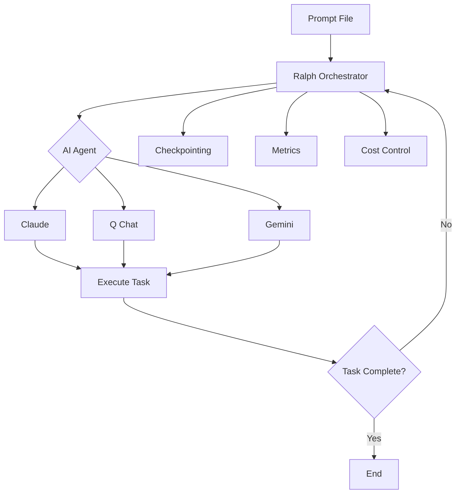
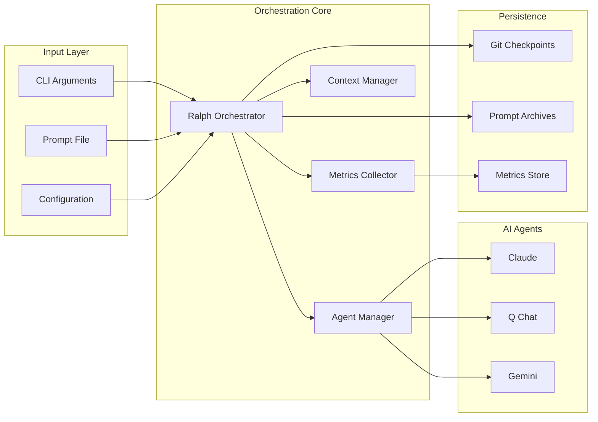

# Overview

## What is Ralph Orchestrator?

Ralph Orchestrator is a production-ready implementation of the Ralph Wiggum orchestration technique for AI agents. It provides a robust framework for running AI agents in a continuous loop until a task is completed, with enterprise-grade safety, monitoring, and cost controls.

The system is named after Ralph Wiggum from The Simpsons, embodying the philosophy of persistent iteration: "Me fail English? That's unpossible!" - just keep trying until you succeed.

## Key Concepts

### The Ralph Wiggum Technique

The Ralph Wiggum technique is a simple yet powerful approach to AI orchestration:

1. **Give the AI a task** via a prompt file
2. **Let it iterate** continuously on the problem
3. **Monitor progress** through checkpoints and metrics
4. **Stop when complete** or when limits are reached

This approach leverages the AI's ability to self-correct and improve through multiple iterations, similar to how humans refine their work through multiple drafts.

### Core Components

## How It Works

### 1. Initialization Phase

When you start Ralph Orchestrator, it:

- Validates the prompt file for security
- Detects available AI agents
- Sets up monitoring and metrics collection
- Creates working directories for checkpoints
- Initializes cost and token tracking

### 2. Iteration Loop

The main orchestration loop:

1. **Pre-flight checks**: Verify token/cost limits haven't been exceeded
2. **Context management**: Check if context window needs summarization
3. **Agent execution**: Run the selected AI agent with the prompt
4. **Response processing**: Capture and analyze the agent's output
5. **Metrics collection**: Track tokens, costs, and performance
6. **Progress evaluation**: Monitor progress towards objectives
7. **Checkpoint**: Save state at configured intervals
8. **Repeat**: Continue until task is complete or limits are reached

### 3. Safety Mechanisms

Multiple layers of protection ensure safe operation:

- **Input validation**: Sanitizes prompts to prevent injection attacks
- **Resource limits**: Enforces token, cost, and runtime boundaries
- **Context overflow**: Automatically summarizes when approaching limits
- **Graceful shutdown**: Handles interrupts and saves state
- **Error recovery**: Retries with exponential backoff

### 4. Completion

When the task completes or limits are reached:

- Final metrics are saved
- State is persisted for analysis
- Usage statistics are reported
- Detailed logs are exported

## Use Cases

Ralph Orchestrator excels at:

### Software Development
- Writing complete applications from specifications
- Refactoring large codebases
- Implementing complex features iteratively
- Debugging difficult issues

### Content Creation
- Writing comprehensive documentation
- Generating test suites
- Creating API specifications
- Developing training materials

### Data Processing
- Analyzing large datasets
- Generating reports
- Data transformation pipelines
- ETL operations

### Research & Analysis
- Literature reviews
- Market research
- Competitive analysis
- Technical investigations

## Benefits

### 🚀 Productivity
- Automate complex, multi-step tasks
- Reduce human intervention
- Parallelize work across multiple agents
- 24/7 operation capability

### 💰 Cost Management
- Real-time cost tracking
- Configurable spending limits
- Per-agent pricing models
- Token usage optimization

### 🔒 Security
- Input sanitization
- Command injection prevention
- Path traversal protection
- Audit trails

### 📊 Observability
- Detailed metrics collection
- Performance monitoring
- Success/failure tracking
- Resource utilization

### 🔄 Reliability
- Automatic retries
- State persistence
- Checkpoint recovery
- Graceful degradation

## Architecture Overview

## Getting Started

To start using Ralph Orchestrator:

1. **Install the tool** and at least one AI agent
2. **Create a prompt file** with your task
3. **Run the orchestrator** with appropriate limits
4. **Monitor progress** through logs and metrics
5. **Retrieve results** when complete

See the [Quick Start](../quick-start.md) guide for detailed instructions.

## Next Steps

- Learn about [Configuration](configuration.md) options
- Understand [Agent](agents.md) selection and capabilities
- Master [Prompt](prompts.md) engineering for best results
- Explore [Cost Management](cost-management.md) strategies
- Set up [Checkpointing](checkpointing.md) for recovery